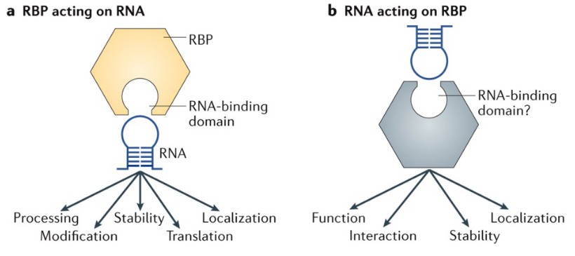

# RBP detector using RNA sequence

## About this model
RNA regulation is significantly dependent on its binding protein parter, which is known as the RNA-binding proterns(RBPs). Unfortunately, the binding preferences for most RBPs are still not well characterized. To help to solve such problem, we propose this RBP detector model which is a combination of convolutional neural network and recurrent neural network. This model can takes the RNA sequence as input and predict whether a certain RBP exists in this sequence.

Note: this model is based on Python3

## The dataset
* Firstly, download the training set from [here](https://drive.google.com/open?id=1w6AQnLohB19v2BcQjVIfxU66uPU6dKaq)
* Extract the .zip file into the 'data' dir
* run `preprocess.py` to get the preprocessed data

## Training
You can change the model parameters in `train.py`. For model training, run `python train.py`, the model will trains all 37 classes for you automatically. After training you can find the final validation accuracy in `val_acc_record` and the training record about accuracy on training set and validation set in `train_record` dir. If you want to plot the accuracy over the training process, run `python plot_train_record.py`

## Test
run `python test.py`.

## Reference
[Prediction of RNA-protein sequence and structure binding preferences using deep convolutional and recurrent neural networks](https://www.biorxiv.org/content/biorxiv/early/2017/06/05/146175.full.pdf)

[Predicting the sequence specificities of DNA-and RNA-binding proteins by deep learning](https://www.nature.com/articles/nbt.3300.pdf)
